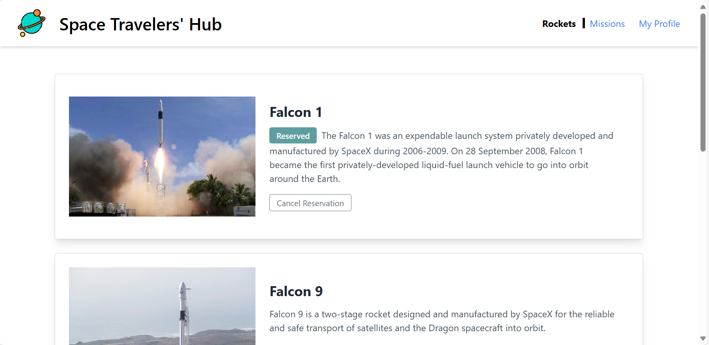
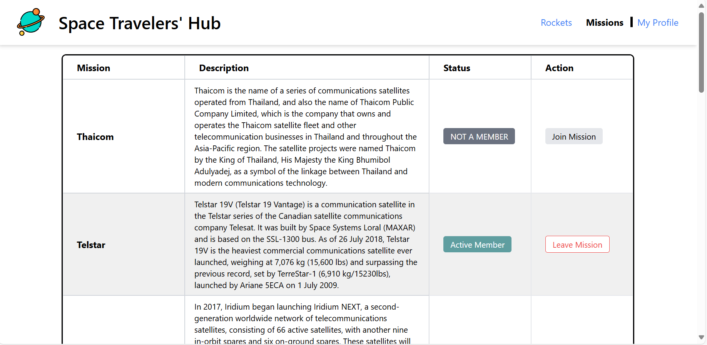
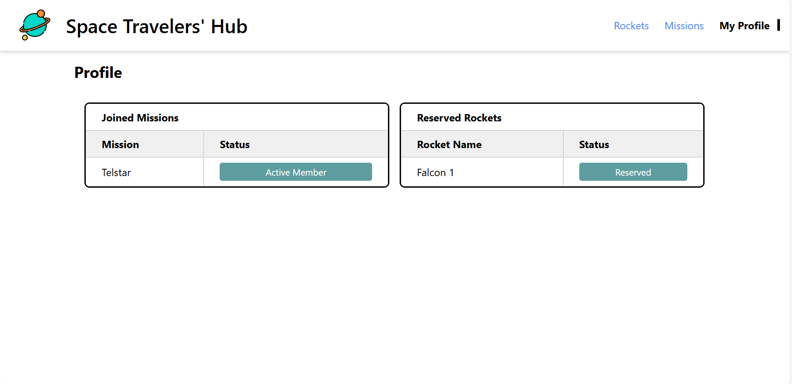

# Space Travelers' Hub

Welcome to **Space Travelers' Hub**, a web application that allows users to explore and participate in space missions, reserve rockets, and view their activity on a personalized profile page. This app fetches real-time data from the SpaceX API and enables users to join/leave missions, reserve/cancel rockets, and track their reserved rockets and joined missions in real-time through the profile page.

## Live Demo




You can view a live demo of the project [here](https://space-travelers-henna.vercel.app/)

## Table of Contents

- [Features](#features)
- [Technologies Used](#technologies-used)
- [Installation](#installation)
- [Usage](#usage)
- [Contributing](#contributing)
- [Author](#author)

## Features

- **Rockets Page:** View available rockets, reserve or cancel reservations.
- **Missions Page:** Browse and join/leave space missions.
- **Profile Page:** View your reserved rockets and joined missions in real-time.
- Data persistence via **localStorage**, ensuring that your reservations and mission data remain intact even after navigating between pages.

## Technologies Used

- **Frontend:** React, Redux, TailwindCSS
- **Backend:** Node.js
- **API:** SpaceX API for fetching rockets and missions data
- **State Management:** Redux (with `localStorage` persistence)
- **Styling:** TailwindCSS for responsive design
- **Version Control:** Git, GitHub

## Installation

1. Clone the repository:
   ```bash
   git clone git@github.com:ZohalMirkhel/space-travelers.git
   cd development
   ```

2. Install dependencies:
   ```bash
   npm install
   ```

3. Start the development server:
   ```bash
   npm start
   ```

4. Visit `http://localhost:3000` in your browser to view the app.

## Usage

- **Reserve Rockets:** Navigate to the Rockets page, click on the "Reserve Rocket" button. Your reserved rockets will be displayed on your profile.
- **Join Missions:** Visit the Missions page, click on the "Join Mission" button. Your joined missions will be listed on your profile page.
- **Profile Page:** Check the rockets you reserved and missions you joined in real-time. Cancel reservations or leave missions anytime.

## Contributing

If you'd like to contribute to this project, please fork the repository, make your changes, and submit a pull request. Contributions to improve the calculator's functionality, fix bugs, or enhance its design are welcome!

## Author

*Zohal Mirkhel*
For any questions, feedback, or support, please contact us at:
- Email: [zohalmirkhel@gmail.com](mailto:zohalmirkhel@gmail.com)
- GitHub: [ZohalMirkhel](https://github.com/ZohalMirkhel)
- LinkedIn: [Zohal Mirkhel](https://www.linkedin.com/in/zohal-mirkhel-840a7530a/)

*Walwala Safi*
- Email: [walwalasafi99@gmail.com](mailto:walwalasafi99@gmail.com)
- GitHub: [Walwala~Safi](https://github.com/WALWALASAFI)
- LinkedIn: [Walwala Safi](https://www.linkedin.com/in/walwala-safi-65b56530a/)